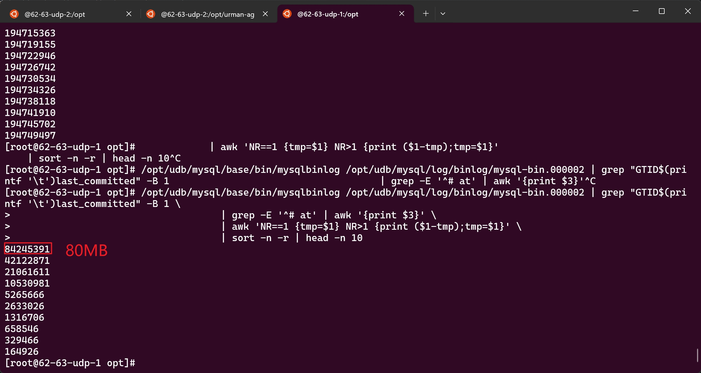

# corrupt-mysql
Corrupting MySQL and testing how the monitoring system reacts.

# how to build
## for linux user
```go
CGO_ENABLED=0 GOOS=linux go build -o corrupt_mysql .
```

# Usages

## Create a big ddl

```bash
./corrupt-mysql bigddl -H10.186.62.63 -P25690 -uuniverse_udb -p123
```

## Create a deadlock

```bash
./corrupt-mysql deadlock -H10.186.62.63 -P25690 -uuniverse_udb -p123
```

## Create a slow query log

```bash
./corrupt-mysql slowlog -H10.186.62.63 -P25690 -uuniverse_udb -p123
```

## Create big transactions

```bash
./corrupt-mysql bt -H10.186.62.63 -P25690 -uuniverse_udb -p123 100MB
```



## Make MySQL's CPU usage high

```bash
./corrupt-mysql hcpu -H10.186.62.63 -P25690 -uuniverse_udb -p123
```